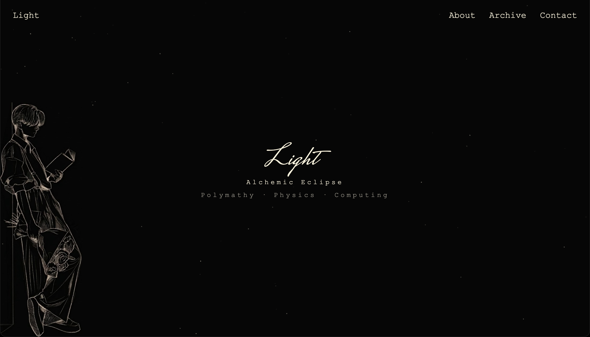
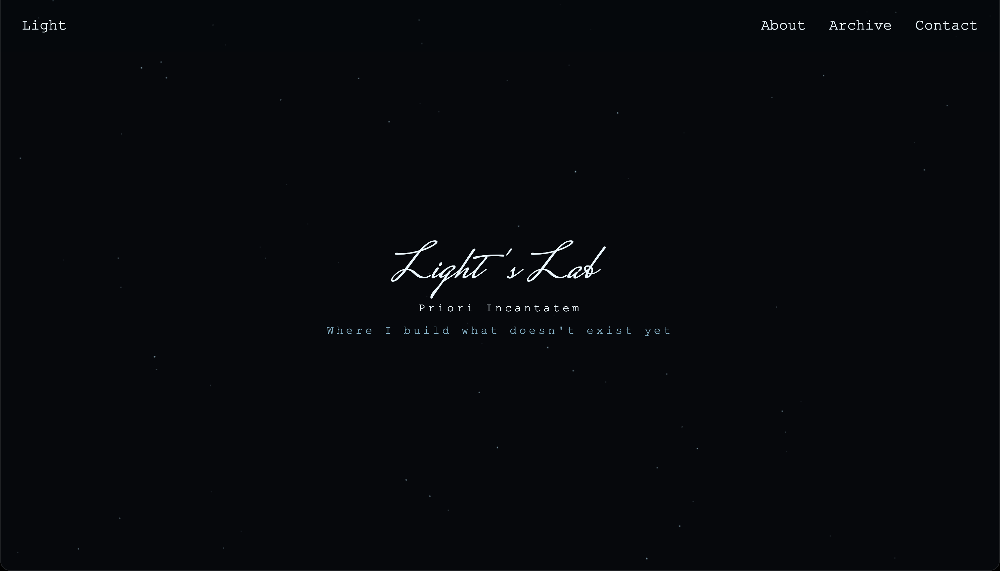
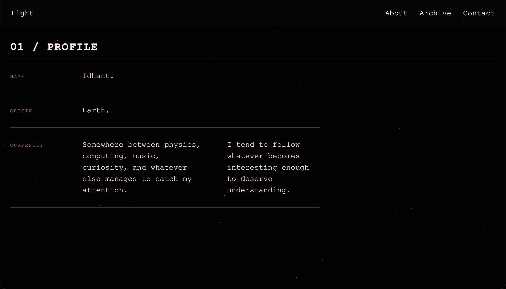

# Light

**Alchemic Eclipse**

> A personal space for polymathy, physics, computing, and whatever else becomes interesting enough to understand.

Light is a personal website built as a digital extension of how I think and work. It is less of a conventional portfolio and more of an evolving record of things I'm learning, building, exploring and occasionally abandoning.

## What is here

**About**
A little more about me, the things I care about, and the strange collection of interests that somehow coexist.

**Archive**
Projects that made it far enough to become something real.

**Lab**
Ideas, experiments, unfinished projects, current obsessions, and questions I'm still trying to answer.

## Features 

- Minimal, typography-focused design
- Custom page-specific visual systems
- Interactive snowfall background
- Mouse interaction with the snow
- Glitch-based transitions and text effects
- Responsive layout for smaller screens

## Built with 

HTML · CSS · JavaScript

No frameworks. No build system. Just the browser doing browser things 🗿

## Status

Light is currently live, but it can never be finished :)

The site is meant to evolve alongside whatever I'm working on, so new experiments, projects, questions, and probably a few questionable decisions will eventually find their way here.

## Screenshots

### Home page

### Lab page

### About page

---
## AI Usage

AI is used while developing Light, for:
- Debugging code
- And learnings about animations/effects

That's all :)

---

## Visit the Site:

It's live on: https://alchemic-eclipse.github.io/light/

And that's it.

    
